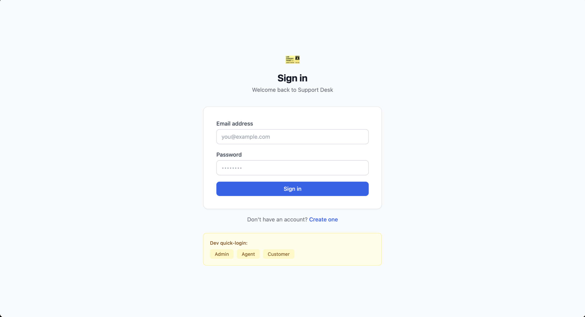
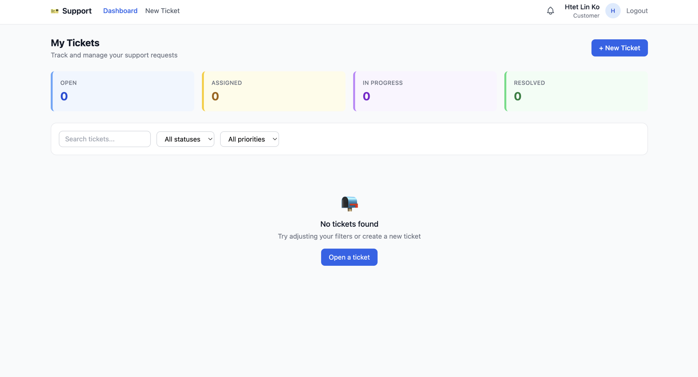
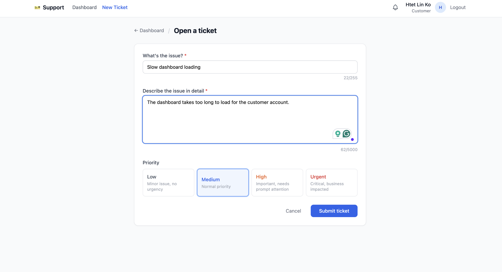
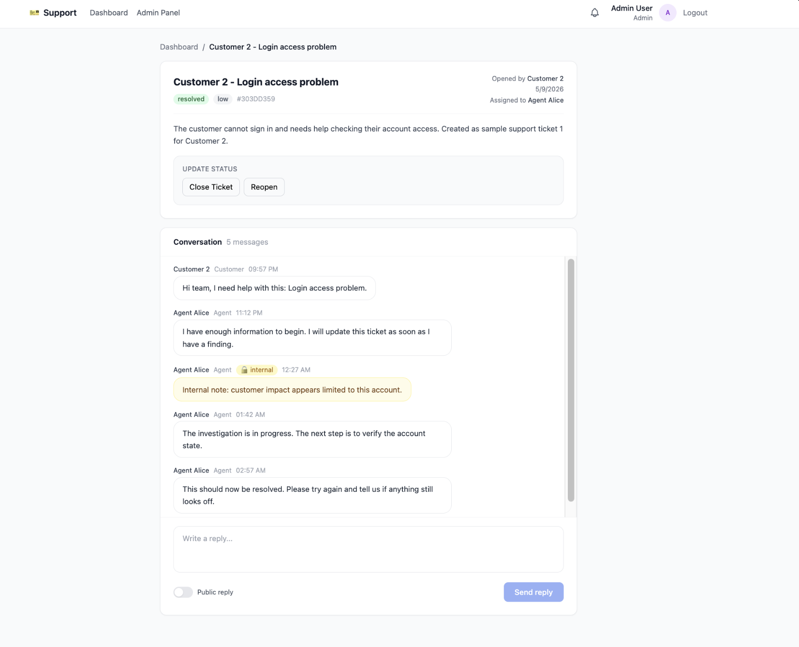
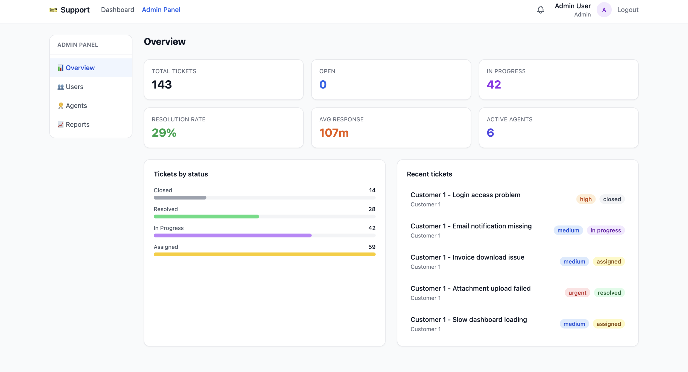
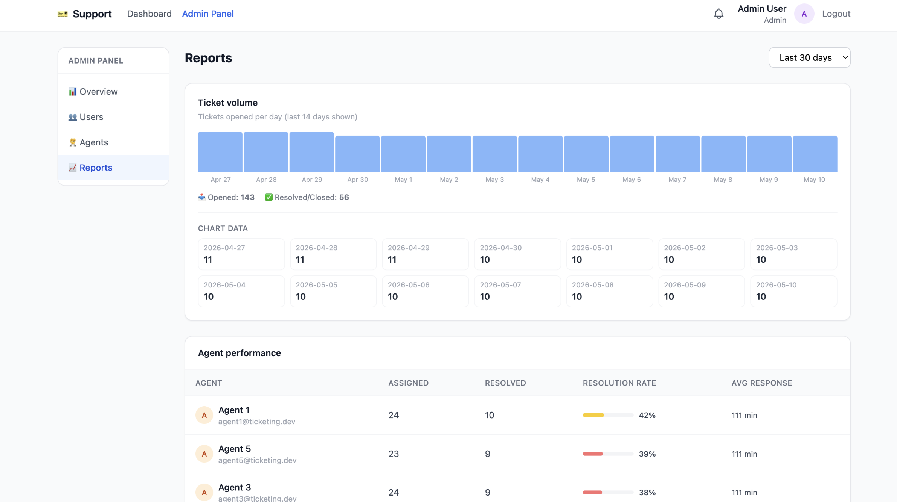
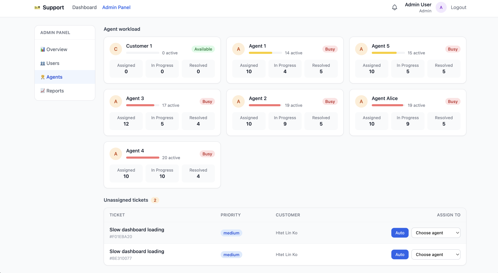
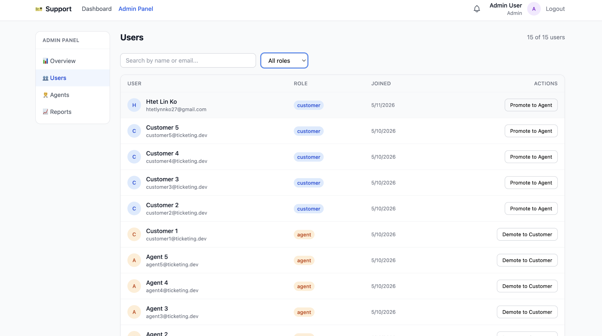
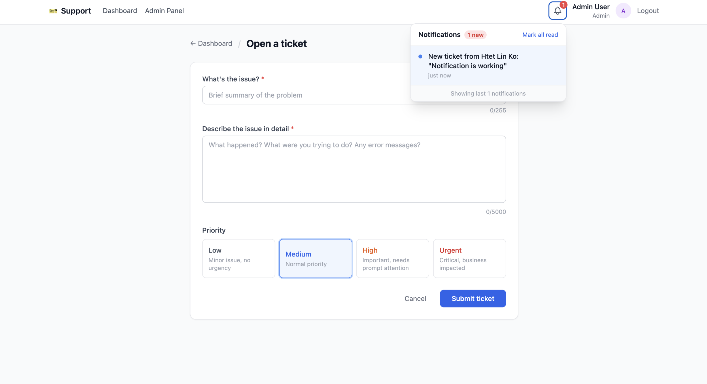
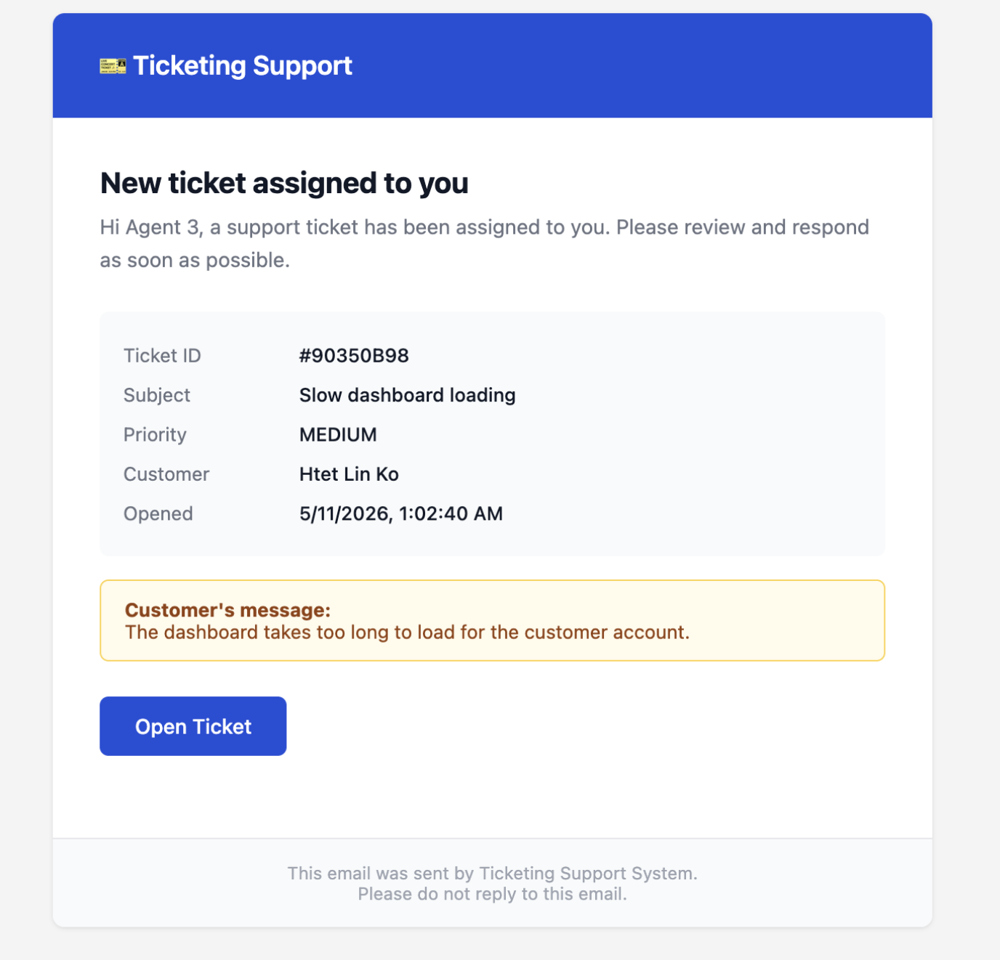

# Customer Support Ticketing System

A full-stack support desk platform with role-based workflows, ticket lifecycle automation, threaded conversations, and admin reporting.

## 1. Project Overview

This project simulates a real customer support operation with three roles:

- `customer`: create tickets, track status, reply to agents
- `agent`: handle assigned tickets, post public/internal comments, update status
- `admin`: manage users, monitor workload, view reports, assign/reassign tickets

It is designed to feel like a production dashboard with realistic ticket data, agent activity, and time-based analytics.

## 2. Features

- JWT authentication (`register`, `login`, `me`)
- Role-based authorization (`customer`, `agent`, `admin`)
- Ticket lifecycle management:
  - create ticket
  - assign / auto-assign / reassign
  - state transitions with history tracking
  - priority updates
- Conversation system:
  - public replies
  - internal notes for agents/admin
  - edit/delete rules by role
- Real-time updates via Socket.IO:
  - ticket events
  - comment events
  - notifications (in progress)
- Admin module:
  - overview metrics
  - user role promotion/demotion
  - agent workload board
  - ticket volume and performance reports

## 3. Tech Stack

- Frontend: React, React Router, Tailwind CSS, Axios, Socket.IO Client
- Backend: Node.js, Express, Sequelize, Socket.IO, JWT
- Database: PostgreSQL
- Tooling: Docker Compose, Sequelize CLI, Prettier

## 4. Screenshots

Add your screenshot files under `docs/screenshots/` with the filenames below.












## 5. Architecture

```text
React Client (3000)
   |
   | HTTP (REST) + WebSocket
   v
Express API + Socket.IO (5002)
   |
   | Sequelize ORM
   v
PostgreSQL
```

Main modules:

- `client/src/pages`: route-level screens
- `client/src/components`: reusable UI and admin/dashboard blocks
- `client/src/context`: auth, tickets, notifications, toast state
- `server/src/controllers`: request/response logic
- `server/src/services`: business workflows (email, notifications, socket)
- `server/src/models`: Sequelize entities (`User`, `Ticket`, `Comment`, `Notification`, `TicketHistory`)

## 6. API Documentation

Base URL: `http://localhost:5002/api`

### Auth

- `POST /auth/register`
- `POST /auth/login`
- `GET /auth/me`

### Tickets

- `GET /tickets`
- `GET /tickets/:ticketId`
- `POST /tickets`
- `PATCH /tickets/:ticketId`
- `PATCH /tickets/:ticketId/status`
- `PATCH /tickets/:ticketId/assign`
- `PATCH /tickets/:ticketId/assign/auto`
- `PATCH /tickets/:ticketId/reassign`
- `GET /tickets/:ticketId/history`

### Comments

- `GET /tickets/:ticketId/comments`
- `POST /tickets/:ticketId/comments`
- `PATCH /tickets/:ticketId/comments/:commentId`
- `DELETE /tickets/:ticketId/comments/:commentId`

### Notifications

- `GET /notifications`
- `PATCH /notifications/read-all`
- `PATCH /notifications/:id/read`

### Admin

- `GET /admin/stats`
- `GET /admin/reports/volume?days=30`
- `GET /admin/reports/agents?days=30`
- `GET /admin/reports/tickets-by-status`
- `GET /admin/users`
- `PATCH /admin/users/:id/role`
- `GET /admin/agents/workload`

## 7. Setup Instructions

### Prerequisites

- Node.js 18+
- npm
- Docker Desktop

### Install

```bash
cd client
npm install
cd ../server
npm install
cd ..
```

### Environment variables

```bash
cp server/.env.example server/.env
cp client/.env.example client/.env
```

Set at minimum:

- `server/.env`: `JWT_SECRET`, DB credentials
- `client/.env`: `REACT_APP_API_URL=http://localhost:5002/api`, `REACT_APP_SOCKET_URL=http://localhost:5002`

### Start infrastructure + backend + frontend

```bash
docker compose up -d postgres
cd server
npm run migrate
npm run seed
npm run dev
```

Open a second terminal:

```bash
cd client
npm start
```

App URLs:

- Frontend: `http://localhost:3000`
- API: `http://localhost:5002`
- Health: `http://localhost:5002/health`

### Format code

Run from project root:

```bash
npm run format
npm run format:check
```

Or separately:

```bash
npm --prefix client run format
npm --prefix server run format
```

## 8. What I Learned

- Designing role-based systems is easier when permissions are enforced consistently at route level and UI level.
- Ticket lifecycle reporting needs history tables/events from day one, not as an afterthought.
- Real-time UX is much better when REST remains the source of truth and sockets are used for event fan-out.
- Admin dashboards become more useful when sample data simulates real workload distribution.
- Seed data quality has direct impact on how credible charts and KPIs feel.

## 9. Future Improvements

- Admin-only AI Agent console:
  - create tickets via natural language
  - auto-assign tickets intelligently
  - generate monthly support summary for admins
  - recommend priority and next actions
- Forgot password / reset password flow:
  - request reset link
  - token-based reset endpoint
  - password reset email template
- Notification system hardening:
  - retry strategy for socket disconnects
  - unread counters per role
- File attachments for tickets/comments
- SLA tracking (response and resolution targets)
- Audit log exports for compliance/reporting
